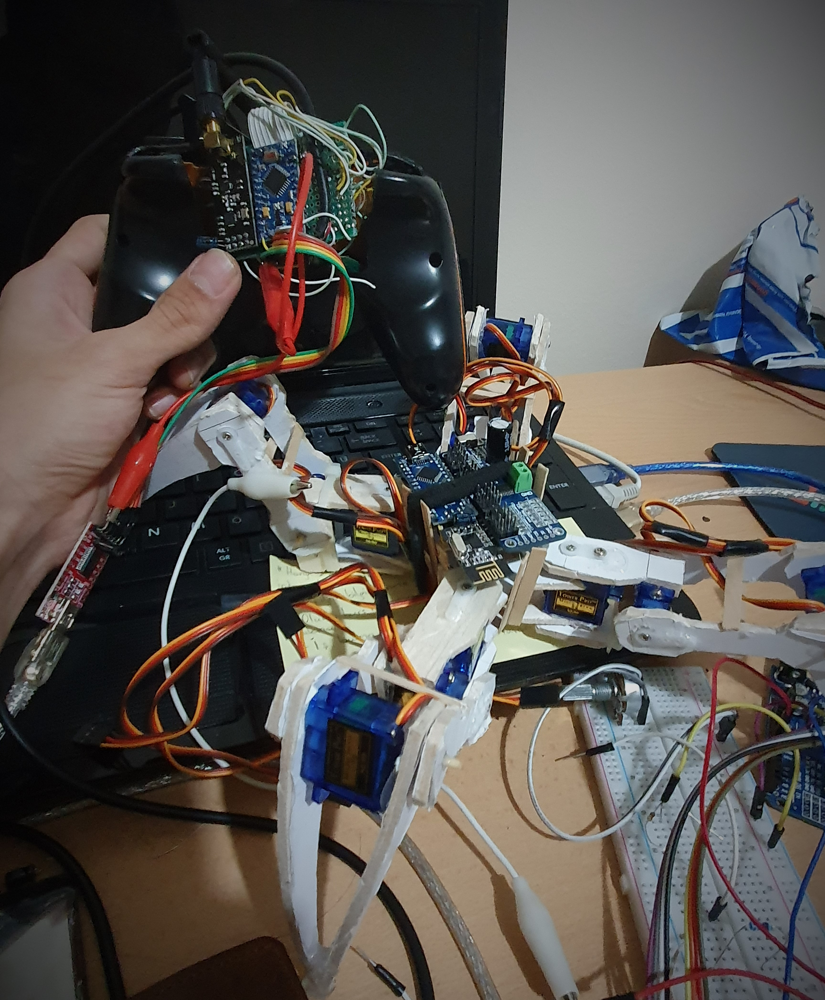

# Quadrupedal Robot on Arduino with RC

Started in November 2020.

This is my first robotics project. Main purpose was to study and make the robot that can walk and controlled remotely. Due to, I did It from scratch. It uses RC communication and recieves It from my [RC controller](https://github.com/KozhaAkhmet/RC-Controller).

I did only one record. I pulished It on [linkedin](https://www.linkedin.com/posts/kozha-akhmet-abdramanov-891144197_arduino-selfmade-quadruped-activity-6774464412280487936-j17C?utm_source=linkedin_share&utm_medium=member_desktop_web).

<a >
     
    
     
 </a>

|                  | On progress | Completed |
| ---------------- | :---------: | :-------: |
| Wiring           |             |  &cross;  |
| RC Communication |             |  &cross;  |
| Kinematics       |             |  &cross;  |

| Function Name  | Not Working | Working |
| -------------- | :---------: | :-----: |
| Default()      |             | &cross; |
| Dance()        |             | &cross; |
| Walk()         |             | &cross; |
| Walktest()     |   &cross;   |         |
| Pos1()         |             | &cross; |
| Pos2()         |             | &cross; |
| Pos3()         |             | &cross; |
| Pos4()         |             | &cross; |
| BodyMove()     |             | &cross; |
| BodyMoveTest() |   &cross;   |         |

    

# Components

- Arduino Namo
- 16 Channel PWM Servo Driver with I2C Interface
- nrf24l01 for Radio Communication
- 18650 Li-ion Battary

# Schematic
//TODO Schematic

